## Задача 1

[Ссылка на репозиторий custom-nginx:1.0.0](https://hub.docker.com/repository/docker/max093r/custom-nginx/general)

## Задача 2
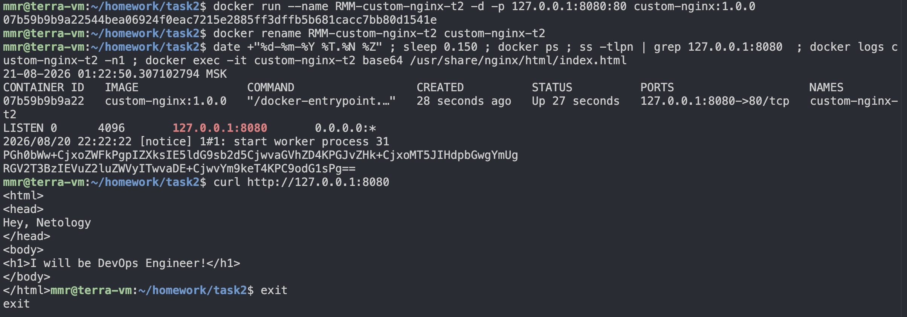

## Задача 3

* Команда Ctrl+C отправляет сигнал SIGINT основному процессу внутри контейнера, т.е. просит его завершиться. Завершение процесса останавливает контейнер, так как ему больше нечего выполнять.

* Мы пробрасываем 8080 порт хоста на 80 порт контейнера. Nginx не отвечает на 80 порту, т.к слушает порт 81.

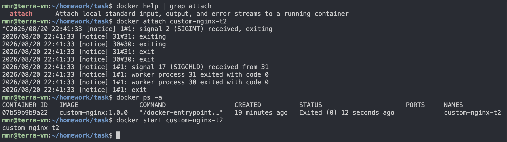
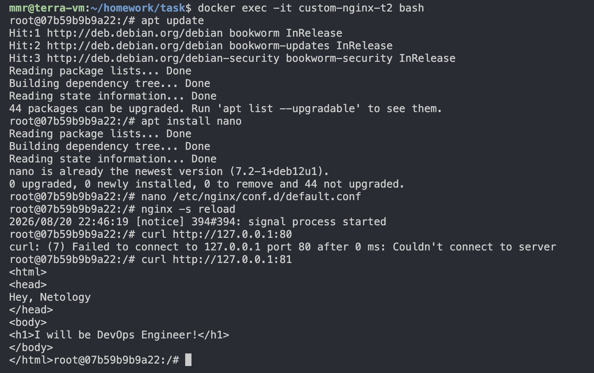
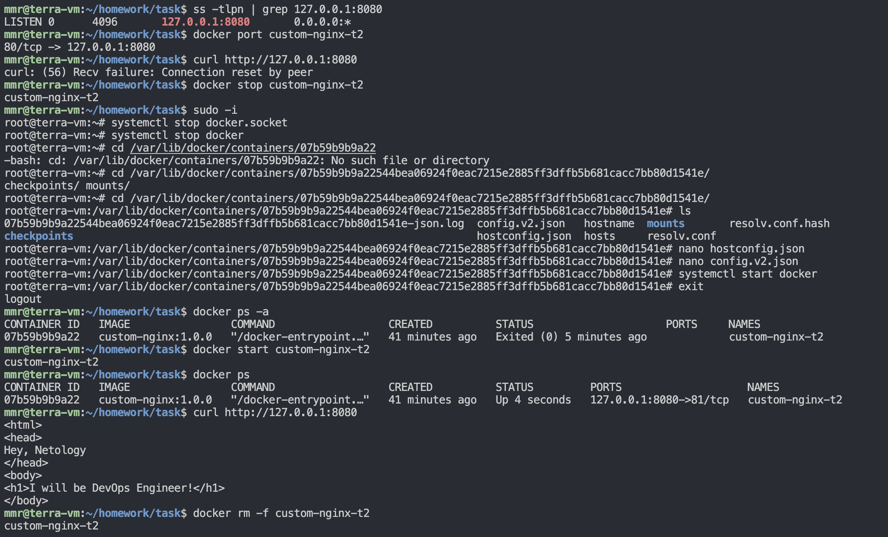

## Задача 4
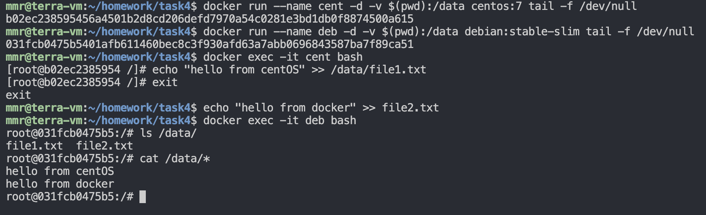

## Задача 5

* При наличии файлов compose.yaml & docker-compose.yaml был запущен compose.yaml потому что такое именование является современным стандартом и имеет более высокий приоритет
* Суть предупреждения при `docker compose up -d` после удаления манифеста в том что в системе есть запущенный контейнер созданный этом компоузом, но сейчас они не описаны в проекте, поэтому предлагается удалить "осиротевшие" контейнеры
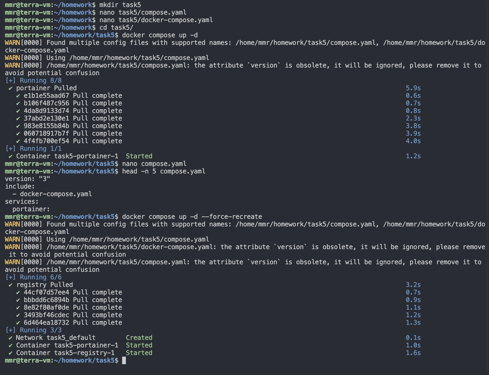
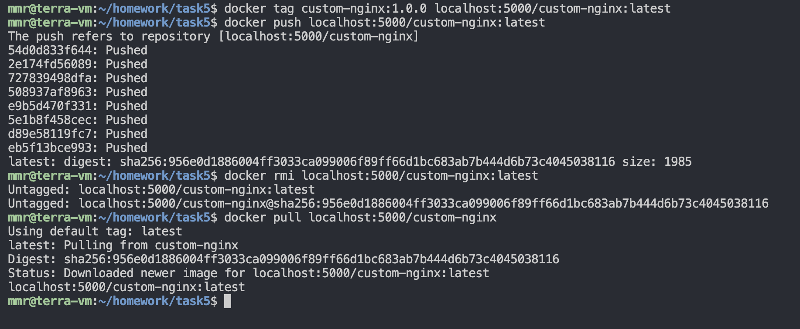
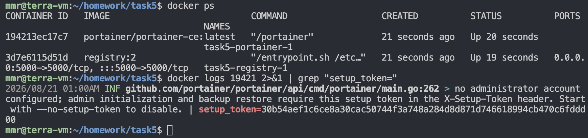
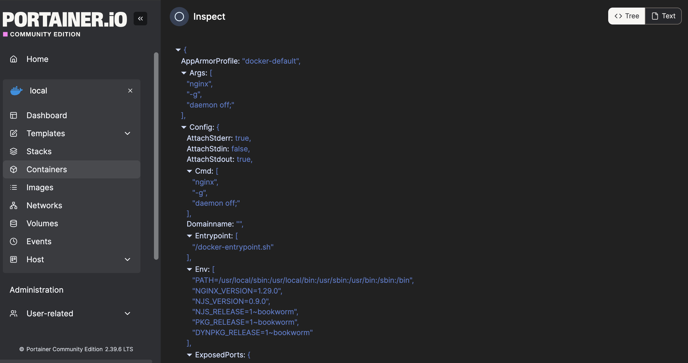
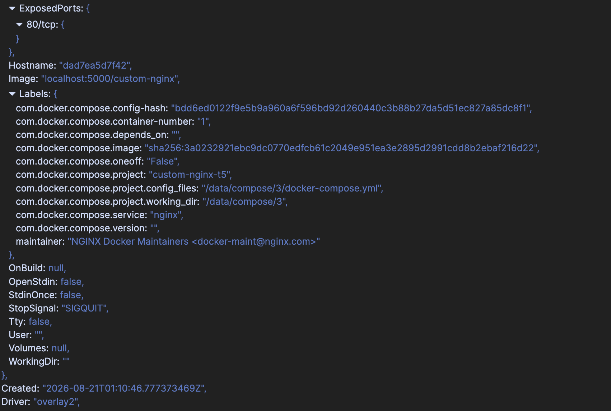
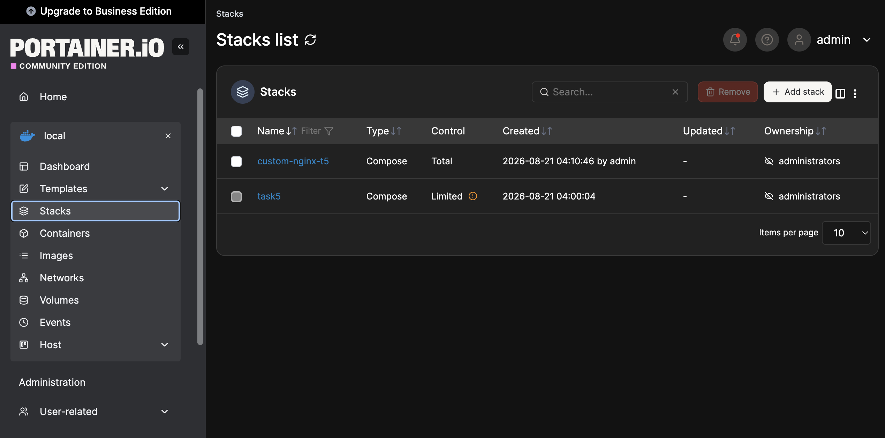
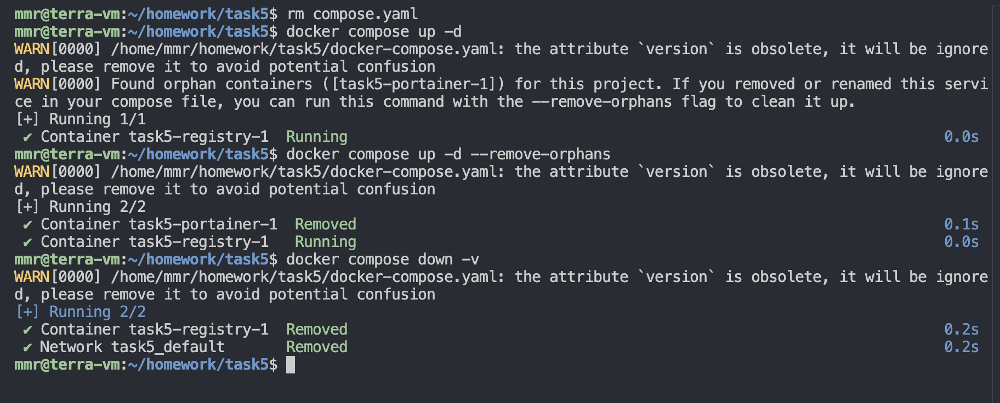

